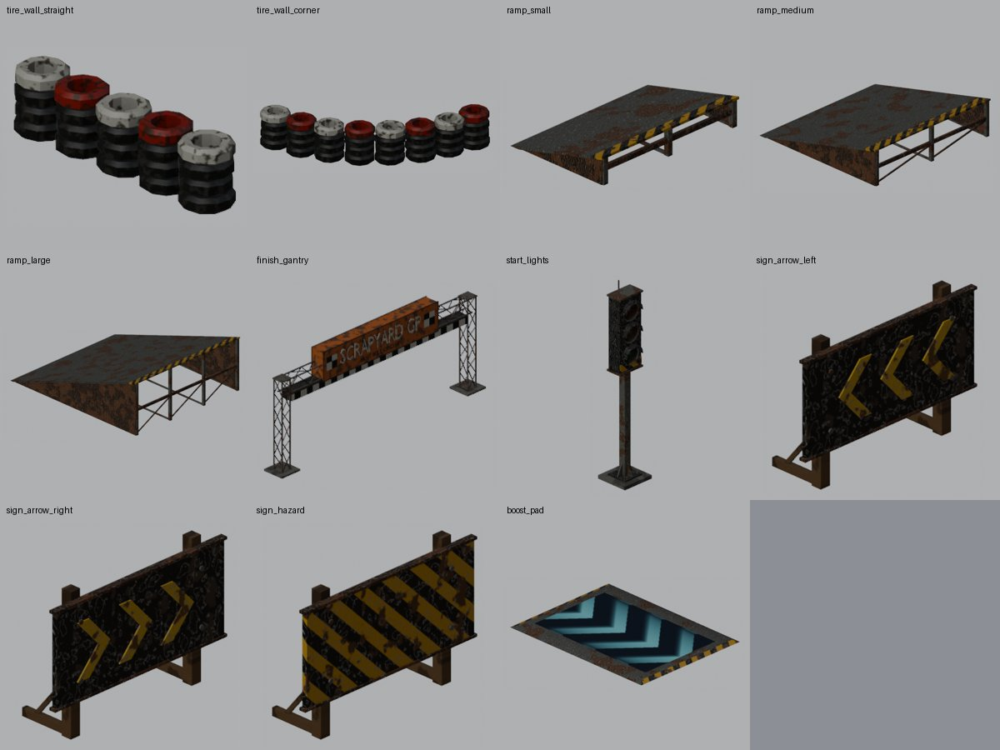

# Track dressing kit

Props for dressing kart tracks that Source's own content lacks: tyre walls, ramps, a finish gantry, start lights, sign
boards and a boost pad. HL2 wasteland style (rusted steel, weathered wood, worn tyres, faded paint), all original and
built here in Blender (asset tier 3, see [modeling-guide.md](modeling-guide.md)).

Every prop faces +X (its front is the entity's facing in Hammer), has its origin on the floor, a `$surfaceprop`, a
simple convex collision mesh and one 512 texture. They are compiled with `$staticprop`, so they work as `prop_static`
(best for scenery: lit by the map's lighting, cheap) and as `prop_dynamic` (needed to change a skin while the map runs).
`prop_physics` is not supported (they have no prop data).

| Model (`models/kart/props/`) | Size (x y z) | Surface | Notes |
| --- | --- | --- | --- |
| `tire_wall_straight.mdl` | 128 x 26 x 32 | `rubbertire` | 5 stacks of 4 tyres, top layer painted red and white. Runs along X, centred: chain them every 128 units. |
| `tire_wall_corner.mdl` | 141 x 141 x 32 | `rubbertire` | A quarter circle of radius 128 around its origin, from (0, -128) to (128, 0). See [Tyre walls](#tyre-walls). |
| `ramp_small.mdl` | 64 x 96 x 16 | `metalpanel` | Steel deck on a welded frame, rising towards +X (14 degrees), open back. |
| `ramp_medium.mdl` | 128 x 128 x 32 | `metalpanel` | Same, 14 degrees. |
| `ramp_large.mdl` | 192 x 160 x 64 | `metalpanel` | Same, 18 degrees, X-braced back. |
| `finish_gantry.mdl` | 48 x 536 x 220 | `metal` | Two lattice towers and a truss across the track, 464 units clear between the towers and 144 under the chequered band. "SCRAPYARD GP" logo board on both faces. |
| `start_lights.mdl` | 28 x 28 x 161 | `metal` | Pole with a three-lamp head (red, yellow, green, top to bottom) facing +X. Skins: 0 all off, 1 red lit, 2 yellow lit, 3 green lit. |
| `sign_arrow_left.mdl` | 25 x 74 x 50 | `wood_panel` | Black board with yellow chevrons pointing left as seen from its front, on two posts. |
| `sign_arrow_right.mdl` | 25 x 74 x 50 | `wood_panel` | The same, pointing right. |
| `sign_hazard.mdl` | 25 x 74 x 50 | `wood_panel` | Yellow and black hazard stripes. |
| `boost_pad.mdl` | 128 x 96 x 2 | `metal` | A low steel plate with a glowing panel of chevrons that scroll towards +X, the way karts go. |

For scale: the kart is about 123 x 71 x 43 and the player 72 tall.

## Placing them

### Tyre walls

Straights run along X with their ends at x = -64 and 64, so put them 128 apart. The corner's origin is the centre of the
curve: with the corner at the origin and no rotation, a straight centred at (-64, -128) meets one end and a straight
turned 90 degrees centred at (128, 64) meets the other. Rotate all three together for other corners. Place them on
the 64 grid so the pieces line up.

### Ramps

A kart driving along the ramp's facing goes up the deck and leaves over the top edge (painted with hazard stripes).
Put them on flat road; the low edge is flush with the floor. Their collision is one wedge matching the deck.

### Finish gantry

Centre it on the finish line, facing along the track. It spans 464 units of road between its towers; for a narrower
road, sink the towers into the walls. The `kart_finish` trigger still marks the line: the gantry is only scenery.

### Start lights

Use the `kart_start_lights` entity (in `hl2kart.fgd`; Hammer shows the model): a solid `prop_dynamic` with this model by
default. Its `skin` keyvalue and input light a lamp (0 off, 1 red, 2 yellow, 3 green), and the race code can switch it
with `CKartStartLights::SetLights()`. Place it beside or above the grid, facing the karts. A `prop_static` of the model
works as fixed decoration, with its `skin` set in Hammer.

### Sign boards

Put arrow signs on the outside of corners, facing the karts coming in, with the arrow pointing the way the track turns.
The board is 14 to 46 units up; behind a 32-unit tyre wall, raise the sign 16-24 units so the arrows show over it.

### Boost pad

Lay a `prop_static` of `boost_pad.mdl` on the road under each `kart_boost_pad` trigger, facing the way karts drive (see
[mapping-guide.md](mapping-guide.md#boost-pads)). The trigger does the boosting; the model only shows where it is. Its
edges are bevelled and only 1.5 units high, so karts drive straight over it.

## Sources and rebuilding

Sources are under `assets_src/props/`:

- `build_props.py`: builds every prop's mesh, collision mesh, texture and QC (`blender -b -P assets_src/props/build_props.py [-- <prop> ...]`).
- `kit.py`: the shared helpers (shapes, procedural finishes baked with AO in Cycles, SMD export, QC).
- `make_materials.py`: draws the tiled textures (lamp lenses, chequer, boost glow) into `materials/`, and writes every VTF and VMT.
- `<prop>/`: each prop's baked `<prop>.png`, `<prop>.smd`, `<prop>_phys.smd` and `<prop>.qc`.
- `build_all.sh`: all three steps and studiomdl (`assets_src/props/build_all.sh [prop ...]`).

Materials are in `game/mod_hl2mp/materials/models/kart/props/`: one per prop (`VertexLitGeneric`), plus `checker`,
`lamp_red`, `lamp_yellow`, `lamp_green` (unlit glass) and their `_on` versions and `boost_pad_glow` (`UnlitGeneric`, so
they glow in the dark; the glow scrolls with a `TextureScroll` proxy).

Renders: `tools/blender/render_model.py` with `--texture-dir assets_src/props/<prop> --texture-dir assets_src/props/materials`.
